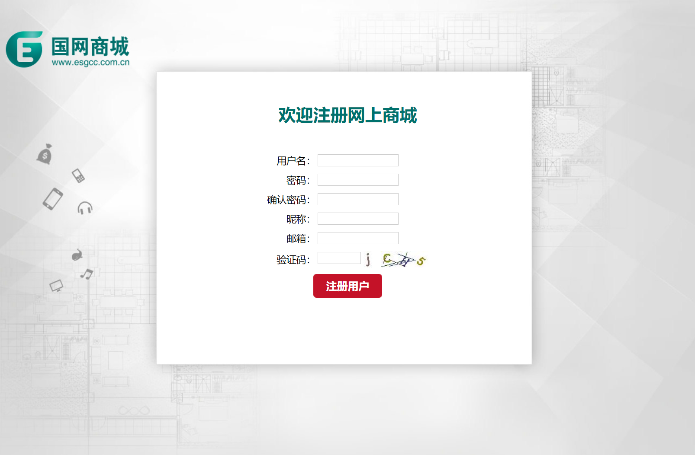

<html>
<body>
<h1>网上商城</h1>
<h2>截图展示</h2>
 
 
<h2>关键技术</h2>
<ul>
    <li>JDBC连接MySQL</li>
    <li>可自定义使用的连接池，在web.xml中配置</li>
    <li>Servlet完成后端注册有效性校验</li>
    <li>jQuery完成前端注册有效性校验</li>
    <li>主页及注册页面均为jsp页面</li>
    <li>使用Ajax技术完成前端用户名校验</li>
</ul>
<h2>版本迭代</h2>
<table>
    <tr>
        <th>版本号</th>
        <th>更新内容</th>
        <th>上传时间</th>
    </tr>
    <tr>
        <td>0.1</td>
        <td>
            <ul>
                <li>初步完成项目方案确定</li>
                <li>完成主页及注册页面的静态资源编写(包括js,css)</li>
                <li>完成主页及注册页面的动态资源编写(包括jsp,servlet)</li>
                <li>通过jdbc链接MySQL数据库</li>
                <li>使用c3p0连接池</li>
            </ul>
        </td>
        <td>2020年8月3日</td>
    </tr>
    <tr>
        <td>0.1.1</td>
        <td>
            <ul>
                <li>可以选择使用哪个连接池，并且在web.xml中指定，现在可以使用DBCP连接池</li>
                <li>通过反射机制设置如果指定连接池调用失败，再调用哪个连接池</li>
                <li>使用Ajax技术完成前端用户名校验</li>
                <li>更改img标签的src属性，使浏览器异步发送GET请求，刷新验证码</li>
            </ul>
        </td>
        <td>2020年8月7日</td>
    </tr>
</table>
<h2>配置情况</h2>
<ul>
<li>本地修改hosts文件,自定义一个域名</li>
<li>虚拟主机使用tomcat7.0.62托管,将上述域名新增为虚拟主机,appBase参数填写绝对路径</li>
<li>本项目基于IntelliJ Idea 2020.01编写</li>
<li>JAVA_HOME环境变量配置为<code>set JAVA_HOME=C:\PROGRA~1\JetBrains\INTELL~1\jbr</code></li>
</ul>
</body>
</html>
