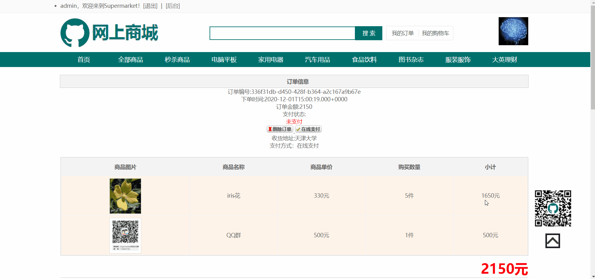
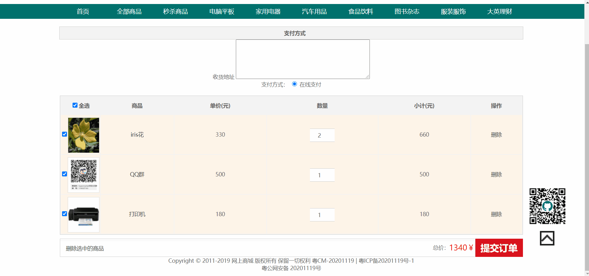
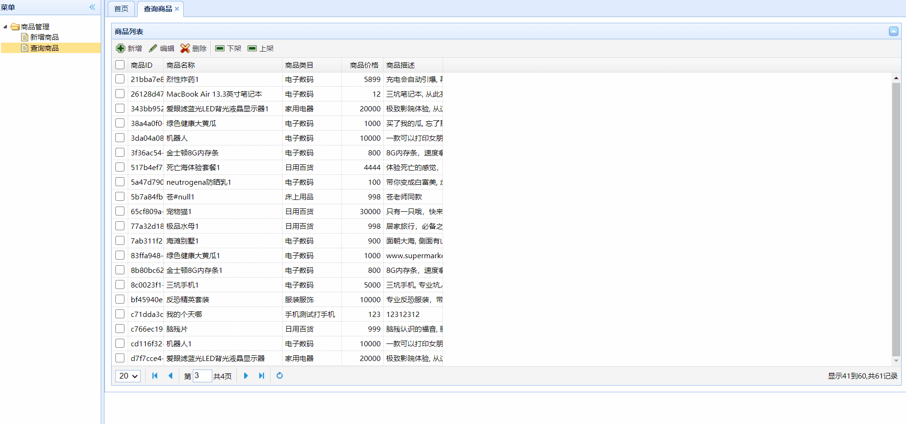
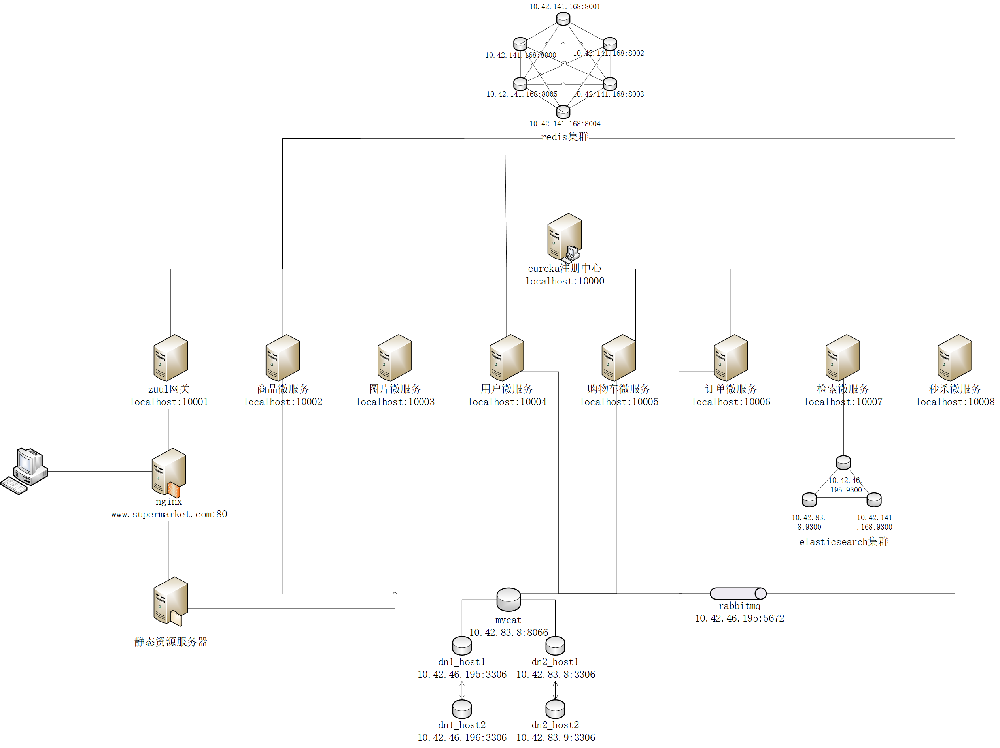

<html lang="zh">
<body>
<h1>网上商城</h1>
<h2>截图展示</h2>
 
 
 
 
 
 
 
 
 
<h2>声明</h2>
<ul>
    <li>本项目静态资源由网络收集得来，并加以大范围修改</li>
    <li>未经许可不得将本项目商用，如需商用请联系作者<a href="mailto:zxr@tju.edu.cn">zxr@tju.edu.cn</a></li>
</ul>
<h2>关键技术</h2>

基于SpringCloud框架开发的商城系统，代码严格遵循MVC分层思想，可部署到服务器上，设计精良，不断完善

<h2>包结构说明</h2>
<ul>
<li>com.supermarket.*.filter对应于微服务的过滤器</li>
<li>com.supermarket.*.listener对应于微服务的监听器</li>
<li>com.supermarket.*.controller对应于微服务的controller层</li>
<li>com.supermarket.*.aspect对应于微服务的切面类</li>
<li>com.supermarket.*.service对应于微服务的service层</li>
<li>com.supermarket.*.dao对应于微服务的持久层</li>
<li>com.supermarket.*.schedule对应于微服务的定时任务</li>
<li>com.supermarket.*.exception对应于微服务的自定义异常</li>
<li>com.supermarket.*.domain对应于微服务的JavaBean</li>
<li>com.supermarket.*.utils对应于微服务的工具类</li>
<li>com.supermarket.*.vo对应于微服务的ViewObject</li>
</ul>
<h2>系统架构</h2>

<h2>功能说明</h2>
<h3>用户微服务(com.supermarket.user)</h3>
<ul>
    <li>用户登录</li>
    <li>免验证码登录</li>
    <li>用户注册</li>
    <li>用户登出</li>
    <li>用户名可用性校验</li>
    <li>用户登录状态获取</li>
    <li>查询用户权限等级</li>
</ul>
<h3>商品微服务(com.supermarket.product)</h3>
<ul>
    <li>分页查询</li>
    <li>单个商品查询</li>
    <li>商品新增</li>
    <li>商品修改</li>
    <li>查询全部商品</li>
</ul>
<h3>公共资源微服务(com.supermarket.common)</h3>
<ul>
    <li>公共资源微服务同时也是SpringCloud的Eureka模块</li>
    <li>提供了常用的JavaBean, ViewObject, 工具类</li>
</ul>
<h3>zuul网关(com.supermarket.gateway)</h3>
<ul>
    <li>SpringCloud的zuul网关模块</li>
    <li>对敏感API调用进行后端鉴权</li>
</ul>
<h3>图片微服务(com.supermarket.image)</h3>
<ul>
    <li>图片上传功能</li>
    <li>生成验证码功能</li>
    <li>清除验证码在redis中的缓存</li>
</ul>
<h3>购物车微服务(com.supermarket.cart)</h3>
<ul>
    <li>购物车查询</li>
    <li>购物车新增商品</li>
    <li>购物车删除商品</li>
    <li>购物车修改商品</li>
    <li>购物车价格查询</li>
</ul>
<h3>订单微服务(com.supermarket.order)</h3>
<ul>
    <li>新增订单</li>
    <li>删除订单</li>
    <li>查询订单</li>
</ul>
<h3>检索微服务(com.supermarket.search)</h3>
<ul>
    <li>分页检索</li>
    <li>新增商品</li>
    <li>删除商品</li>
    <li>建立索引</li>
</ul>
<h3>秒杀微服务(com.supermarket.instantbuy)</h3>
<ul>
    <li>全部秒杀商品查询</li>
    <li>单个秒杀商品查询</li>
    <li>发起秒杀</li>
</ul>
<h2>交流群</h2>
点击链接加入群聊【Supermarket项目交流群】：<a href="https://jq.qq.com/?_wv=1027&k=wlpUy5jo">https://jq.qq.com/?_wv=1027&k=wlpUy5jo</a>  

<h2>部署教程</h2>
<video src="http://8.129.225.215/video/supermarket部署视频.mp4" controls="controls" width="500px;height:500px;"></video>
<ul>
    <li><a href="https://blog.csdn.net/sjdjjd6466446/article/details/110005937" target="_blank">0.4.x版本博客教程</a>(感谢<a href="https://github.com/BlackPeachLawn" target="_blank">BlackPeachLawn</a>)</li>
    <li><a href="http://8.129.225.215/" target="_blank">0.4.x版本视频教程</a>(感谢<a href="https://github.com/20427492" target="_blank">20427492</a>)</li>
    <li><a href="./部署教程/ssm10月1号版本使用.txt" target="_blank">0.3.x版本文档教程</a>(感谢<a href="https://github.com/20427492" target="_blank">20427492</a>)</li>
</ul>
<h2>版本迭代</h2>
<table>
    <tr>
        <th>版本号</th>
        <th>更新内容</th>
        <th>上传时间</th>
    </tr>
    <tr>
        <td>0.1</td>
        <td>
            <ul>
                <li>初步完成项目方案确定</li>
                <li>完成主页及注册页面的静态资源编写(包括js,css)</li>
                <li>完成主页及注册页面的动态资源编写(包括jsp,servlet)</li>
                <li>通过jdbc链接MySQL数据库</li>
                <li>使用c3p0连接池</li>
            </ul>
        </td>
        <td>2020年8月3日</td>
    </tr>
    <tr>
        <td>0.1.1</td>
        <td>
            <ul>
                <li>可以选择使用哪个连接池，并且在web.xml中指定，现在可以使用DBCP连接池</li>
                <li>通过反射机制设置如果指定连接池调用失败，再调用哪个连接池</li>
                <li>使用Ajax技术完成前端用户名校验</li>
                <li>更改img标签的src属性，使浏览器异步发送GET请求，刷新验证码</li>
            </ul>
        </td>
        <td>2020年8月7日</td>
    </tr>
    <tr>
        <td>0.1.2</td>
        <td>
            <ul>
                <li>使用JDBC.properties进行全局JDBC配置</li>
                <li>去掉JDBC的反射调用</li>
                <li>使用cookie完成记住用户名功能</li>
                <li>新增登录功能：使用session完成会话级别的数据传递</li>
                <li>新增注销功能：通过ajax请求销毁session</li>
                <li>修改静态页面，使其实现对logo.png的单独依赖</li>
            </ul>
        </td>
        <td>2020年8月9日</td>
    </tr>
    <tr>
        <td>0.2</td>
        <td>
            <ul>
                <li>使用EL表达式替换jsp页面中的脚本表达式</li>
                <li>修改静态资源，主页增加右下角浮动项以及向上返回功能</li>
                <li>新增错误页面提示</li>
                <li>重构为JavaEE三层经典架构</li>
            </ul>
        </td>
        <td>2020年8月20日</td>
    </tr>
    <tr>
        <td>0.2.1</td>
        <td>
            <ul>
                <li>使用过滤器完成全局请求参数拦截处理，包括全局中文乱码处理、全局password请求参数加密</li>
                <li>通过过滤器实现全局连接池选定</li>
                <li>通过过滤器实现自动登录功能</li>
                <li>通过装饰者模式扩展request对象</li>
            </ul>
        </td>
        <td>2020年8月22日</td>
    </tr>
    <tr>
        <td>0.2.2</td>
        <td>
            <ul>
                <li>使用log4j框架进行日志记录</li>
                <li>修复重启服务器自动登录失效的bug</li>
                <li>加入网页标题图标</li>
            </ul>
        </td>
        <td>2020年8月24日</td>
    </tr>
    <tr>
        <td>0.2.3</td>
        <td>
            <ul>
                <li>将JDBC初始化功能交由监听器实现，并移除对应的过滤器</li>
                <li>使用过滤器实现JDBC反注册，避免内存泄漏</li>
                <li>使用注解替代web.xml完成servlet和监听器的注册</li>
                <li>重写前端校验，对于支持html5的浏览器使用其自带校验</li>
            </ul>
        </td>
        <td>2020年8月25日</td>
    </tr>
    <tr>
        <td>0.3</td>
        <td>
            <ul>
                <li>使用Spring、SpringMVC、MyBatis重构该web应用</li>
                <li>使用User类的装饰者模式完成密码的md5加密功能</li>
                <li>使用SpringMVC拦截器记录用户的访问请求</li>
                <li>使用切面记录错误日志，并统计响应时间</li>
                <li>升级log4j为log4j2</li>
                <li>使用html5及jQuery相结合的方式进行前端表单校验</li>
            </ul>
        </td>
        <td>2020年9月25日</td>
    </tr>
    <tr>
        <td>0.3.1</td>
        <td>
            <ul>
                <li>新增UserDao的SpringJDBC模板类实现</li>
                <li>注册用户功能开启事务，修复多个用户同时注册时可能造成用户名重复的bug</li>
            </ul>
        </td>
        <td>2020年9月29日</td>
    </tr>
    <tr>
        <td>0.3.2</td>
        <td>
            <ul>
                <li>新增备选的DBCP连接池配置</li>
            </ul>
        </td>
        <td>2020年10月1日</td>
    </tr>
    <tr>
        <td>0.4</td>
        <td>
            <ul>
                <li>使用Maven重构依赖</li>
                <li>使用SpringCloud重构项目</li>
                <li>重构数据库</li>
                <li>增加common微服务: 存放共享资源(如JavaBean, 工具类, ViewObject)</li>
                <li>增加商品微服务：新增、修改、查询功能</li>
                <li>增加用户微服务：用户名校验、注册</li>
                <li>增加图片微服务：图片上传</li>
                <li>增加nginx：负载均衡、动态静态资源分离</li>
            </ul>
        </td>
        <td>2020年11月10日</td>
    </tr>
    <tr>
        <td>0.4.1</td>
        <td>
            <ul>
                <li>新增redis配置，通过redis解决微服务之间数据共享问题</li>
                <li>完善用户微服务：实现登录、登出、登录状态获取，修复注册未校验密码一致性的Bug</li>
                <li>改进redis数据结构：将key-value改进为hash，从而实现单点登录</li>
                <li>使用AOP切面实现登录时长的自动延长</li>
            </ul>
        </td>
        <td>2020年11月12日</td>
    </tr>
    <tr>
        <td>0.4.2</td>
        <td>
            <ul>
                <li>调整前端css，增加注册、登录的错误提示</li>
                <li>新增注册成功页面</li>
                <li>其他前端页面样式的调整</li>
            </ul>
        </td>
        <td>2020年11月13日</td>
    </tr>
    <tr>
        <td>0.4.3</td>
        <td>
            <ul>
                <li>完善图片微服务：新增功能生成验证码、验证码缓存清理(避免前端连续请求验证码爆掉redis)</li>
                <li>完善用户微服务：登录、注册需要验证码，登录或注册成功后清除验证码缓存(节省redis内存)</li>
                <li>完善商品微服务：商品新增、查询、编辑触发被动缓存</li>
            </ul>
        </td>
        <td>2020年11月14日</td>
    </tr>
    <tr>
        <td>0.4.4</td>
        <td>
            <ul>
                <li>新增购物车微服务：实现商品查询、商品新增、商品修改、商品删除功能</li>
                <li>通过事务实现购买数量后端校验：防止购买量大于库存</li>
                <li>在前端实现购买数量校验校验：防止购买量大于库存</li>
            </ul>
        </td>
        <td>2020年11月15日</td>
    </tr>
    <tr>
        <td>0.4.5</td>
        <td>
            <ul>
                <li>完善图片微服务：解决redis中验证码缓存无法清理的BUG</li>
                <li>完善用户微服务：新增记住用户名、自动登录功能</li>
            </ul>
        </td>
        <td>2020年11月18日</td>
    </tr>
    <tr>
        <td>0.4.6</td>
        <td>
            <ul>
                <li>修复自动登录与单点登录功能冲突的bug。</li>
                <li>替换网页logo，避免不必要的责任纠纷</li>
            </ul>
        </td>
        <td>2020年11月19日</td>
    </tr>
    <tr>
        <td>0.4.7</td>
        <td>
            <ul>
                <li>新增订单微服务：实现订单新增、订单查询、订单删除功能</li>
                <li>完善购物车微服务：新增总价格查询功能</li>
                <li>数据库迁移至服务器，并通过MyCat管理分库分表</li>
                <li>每个数据分片通过双向主从实现MySQL高可用，并开启读写分离</li>
            </ul>
        </td>
        <td>2020年11月24日</td>
    </tr>
    <tr>
        <td>0.4.8</td>
        <td>
            <ul>
                <li>新增检索微服务：分页检索、增加文档、删除文档、修改文档</li>
                <li>完善商品微服务：查询全部商品</li>
                <li>完善前端：进入后台权限校验</li>
            </ul>
        </td>
        <td>2020年11月30日</td>
    </tr>
    <tr>
        <td>0.4.9</td>
        <td>
            <ul>
                <li>新增秒杀微服务：全部秒杀商品查询、单个秒杀商品查询、发起秒杀(尚未联调)</li>
                <li>修改部分前端页面</li>
            </ul>
        </td>
        <td>2020年12月6日</td>
    </tr>
    <tr>
        <td>0.5</td>
        <td>
            <ul>
                <li>完善秒杀微服务：修复若干bug</li>
                <li>完善zuul网关：对敏感API调用进行后端鉴权</li>
                <li>完善用户微服务：新增权限查询功能</li>
            </ul>
        </td>
        <td>2020年12月9日</td>
    </tr>
    <tr>
        <td>0.5.1</td>
        <td>
            <ul>
                <li>完善秒杀微服务：修复发起秒杀功能中的线程安全问题</li>
                <li>新增全系统架构图</li>
            </ul>
        </td>
        <td>2020年12月10日</td>
    </tr>
    <tr>
        <td>0.5.2</td>
        <td>
            <ul>
                <li>完善秒杀微服务：修复发起秒杀功能中的线程安全问题</li>
                <li>完善zuul网关：过滤器实现更细粒度鉴权</li>
                <li>完善检索微服务：修复新增和编辑商品时无法同步到elasticsearch的Bug</li>
            </ul>
        </td>
        <td>2020年12月11日</td>
    </tr>
    <tr>
        <td>0.5.3</td>
        <td>
            <ul>
                <li>微服务添加熔断器，避免单个故障导致集群崩溃</li>
                <li>使用Feign替代Ribbon进行微服务间调用</li>
                <li>完善检索微服务：修复微服务启动时创建索引失败的bug</li>
                <li>新增log4j2日志框架支持</li>
            </ul>
        </td>
        <td>2020年12月12日</td>
    </tr>
</table>

<h2>配置情况</h2>
<ul>
    <li>JDK版本：<a href="http://openjdk.java.net/projects/jdk/11/" target="_blank">OpenJDK11</a></li>
    <li><a href="http://nginx.org/en/download.html" target="_blank">nginx：1.19.1</a></li>
    <li><a href="https://maven.apache.org/download.cgi" target="_blank">maven: 3.6.3</a></li>
    <li><a href="https://downloads.mysql.com/archives/community/" target="_blank">MySql: 5.5.27</a></li>
    <li><a href="http://download.redis.io/releases/" target="_blank">Redis: 3.2.11</a></li>
    <li><a href="https://github.com/MyCATApache/Mycat-download/tree/master/1.5-RELEASE" target="_blank">MyCat: 1.5.1</a></li>
    <li><a href="https://www.elastic.co/cn/downloads/past-releases/elasticsearch-6-8-6" target="_blank">ElasticSearch: 6.8.6</a></li>
    <li><a href="https://github.com/medcl/elasticsearch-analysis-ik/releases/tag/v6.8.6" target="_blank">IK分词器: 6.8.6</a></li>
    <li><a href="https://github.com/rabbitmq/rabbitmq-server/releases/tag/v3.7.7" target="_blank">RabbitMQ: 3.7.7</a></li>
    <li>开发环境：<a href="https://www.jetbrains.com/idea/download/other.html" target="_blank">IntelliJ Idea 2020.1.4</a></li>
    <li>框架：<a href="https://github.com/spring-projects/spring-boot/releases/tag/v2.2.5.RELEASE" target="_blank">Springboot 2.2.5.RELEASE</a>, <a href="https://spring.io/blog/2020/03/05/spring-cloud-hoxton-service-release-3-sr3-is-available" target="_blank">SpringCloud Hoxton.SR3</a></li>
    <li>
        hosts配置:  
        127.0.0.1 www.supermarket.com  
        127.0.0.1 image.supermarket.com
    </li>
</ul>
<h2>遇到的bug锦集(作为记录，博君一笑)</h2>
<ul>
    <li>HttpServletRequest的装饰者类HttpServletRequestDecorator中的getParameterMap重写方法中，不能在原地进行参数字符集修改，否则如果调用两次及以上该方法时会编码多次，造成乱码</li>
    <li>对请求参数的拦截处理，如果用到装饰者模式，最好在一处完成。如果在多处完成会造成请求参数的重复处理，从而导致乱码或者拿到非预期的参数值</li>
    <li>用户的登录信息最好保存到session域中，在0.2.1中的自动登录成功后误把user对象塞入到了request域，造成了重启服务器自动登录失效的bug。</li>
    <li>使用过滤器将密码加密，不仅要将参数为password的值加密，还要将参数为password2的值加密，否则永远确认密码不一致</li>
    <li>使用SpringMVC处理请求参数，如果自动封bean作为方法参数传入，那么该bean所携带的请求参数是不经过过滤器的！原因未知</li>
    <li>自动登录最好使用过滤器实现，因为SpringMVC拦截器无法拦截index.jsp。而因为使用过滤器的时候Spring容器还未初始化，所以过滤器的属性需要手工注入</li>
    <li>即便上一次响应设置了cookie的path，下一次请求携带的cookie的path也会是null。因此如果要修改或删除cookie，一定要严格满足name, path都设置，否则可能会无效</li>
    <li>如果间接依赖了spring-cloud-starter-netflix-eureka-server，一定要把jackson-dataformat-xml排除掉，因为如果不排除掉会导致返回给浏览器的对象是xml格式而非json格式</li>
    <li>MyBatis如果使用bean传参，不要使用&lt;if&gt;标签内的test属性名应该对应bean属性名而非表的列名。否则会报There is no getter for property named 'xx' in 'class xxx</li>
    <li>在Springboot项目中，如果要在application.properties中写自定义配置项，若该配置项为路径字符串，一定要写全路径，从盘符写起，否则会自动在前面拼接tomcat的临时路径</li>
    <li>html中onsubmit事件要放在form标签内，放在&lt;input type=&quot;submit&quot; /&gt;标签内无效</li>
    <li>启动的时候需要先启动redis再启动微服务，否则会报RedisConnectionFailureException</li>
    <li>redis作为缓存使用时，建议捕获RedisConnectionFailureException异常，从而在redis崩掉的情况下能够直接访问数据库</li>
    <li>基于SpringCloud的Ribbon模块在微服务之间相互调用时，不经过zuul网关</li>
    <li>MySQL主从高可用时，如果因为错误数据导致挂接失败，需要先取消挂接(stop slave)，手动删除错误数据，再重新挂接(start slave)</li>
    <li>MyCat1.5.1版本还不支持复杂SQL，比如update...select..., insert ...select...等</li>
    <li>insert的时候加上列名是一个好习惯，因为MyCat1.5.1不支持省略列名的写法</li>
    <li>直接使用RedisTemplate模板类，键和值会出现类似\xac\xed\x00\x05t\x00的东西，此时要么不去手动查看redis输出，要么换用StringRedisTemplate</li>
    <li>用nginx也能做到外部调用内部api的拦截，只需要将提供给前端的api路径和提供给后端的api路径区分开。比如提供给前端的api路径是/manage/query，提供给后端的api是/backend/query，因为nginx拼接了"/manage"，所以自然找不到/backend/query</li>
</ul>
</body>
</html>
