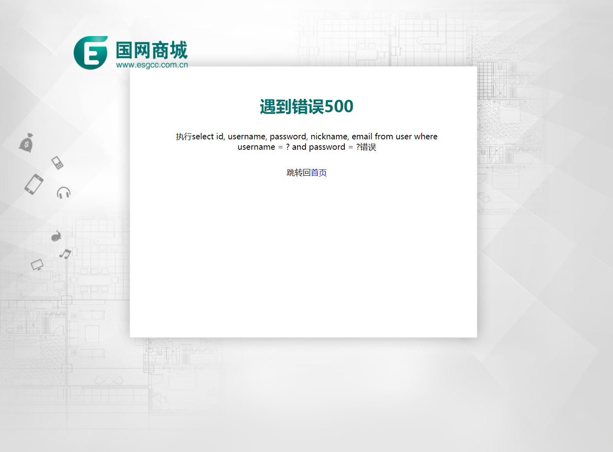

<html>
<body>
<h1>网上商城</h1>
<h2>截图展示</h2>
 
 
 
 
 
<h2>声明</h2>
<ul>
    <li>本项目静态资源由网络收集得来，并加以大范围修改</li>
    <li>未经许可不得将本项目商用，如需商用请联系作者<a href="mailto:zxr@tju.edu.cn">zxr@tju.edu.cn</a></li>
</ul>
<h2>关键技术</h2>

基于JavaWeb三层经典架构开发

<h3>前端</h3>
<ul>
    <li>前端对应View层，由JSP、JS、CSS实现</li>
    <li>前端使用jsp页面展示，并通过EL表达式接收服务器打给浏览器的数据</li>
    <li>使用js实现网页动态效果，通过jQuery简化操作，并实现前端的数据校验</li>
    <li>使用Ajax技术完成前端用户名可用性校验、退出登录功能</li>
</ul>
<h3>com.supermarket.web</h3>
<ul>
    <li>com.supermarket.web包对应Controller层，主要通过servlet实现</li>
    <li>主要功能：接收前端请求，并根据需求交给com.supermarket.service处理</li>
</ul>
<h3>com.supermarket.service</h3>
<ul>
    <li>com.supermarket.service包属于Model层</li>
    <li>使用com.supermarket.service.UserService完成对用户数据的各种后端校验</li>
    <li>使用com.supermarket.service.ValistrService完成生成验证码相关功能</li>
</ul>
<h3>com.supermarket.dao</h3>
<ul>
    <li>com.supermarket.dao包属于Model层</li>
    <li>使用com.supermarket.service.UserDao完成对数据库user表的增删改查</li>
    <li>调用JDBC连接MySQL，可自定义使用C3P0连接池或DBCP连接池</li>
</ul>
<h2>版本迭代</h2>
<table>
    <tr>
        <th>版本号</th>
        <th>更新内容</th>
        <th>上传时间</th>
    </tr>
    <tr>
        <td>0.1</td>
        <td>
            <ul>
                <li>初步完成项目方案确定</li>
                <li>完成主页及注册页面的静态资源编写(包括js,css)</li>
                <li>完成主页及注册页面的动态资源编写(包括jsp,servlet)</li>
                <li>通过jdbc链接MySQL数据库</li>
                <li>使用c3p0连接池</li>
            </ul>
        </td>
        <td>2020年8月3日</td>
    </tr>
    <tr>
        <td>0.1.1</td>
        <td>
            <ul>
                <li>可以选择使用哪个连接池，并且在web.xml中指定，现在可以使用DBCP连接池</li>
                <li>通过反射机制设置如果指定连接池调用失败，再调用哪个连接池</li>
                <li>使用Ajax技术完成前端用户名校验</li>
                <li>更改img标签的src属性，使浏览器异步发送GET请求，刷新验证码</li>
            </ul>
        </td>
        <td>2020年8月7日</td>
    </tr>
    <tr>
        <td>0.1.2</td>
        <td>
            <ul>
                <li>使用JDBC.properties进行全局JDBC配置</li>
                <li>去掉JDBC的反射调用</li>
                <li>使用cookie完成记住用户名功能</li>
                <li>新增登录功能：使用session完成会话级别的数据传递</li>
                <li>新增注销功能：通过ajax请求销毁session</li>
                <li>修改静态页面，使其实现对logo.png的单独依赖</li>
            </ul>
        </td>
        <td>2020年8月9日</td>
    </tr>
    <tr>
        <td>0.2</td>
        <td>
            <ul>
                <li>使用EL表达式替换jsp页面中的脚本表达式</li>
                <li>修改静态资源，主页增加右下角浮动项以及向上返回功能</li>
                <li>新增错误页面提示</li>
                <li>重构为JavaEE三层经典架构</li>
            </ul>
        </td>
        <td>2020年8月20日</td>
    </tr>
    <tr>
        <td>0.2.1</td>
        <td>
            <ul>
                <li>使用过滤器完成全局请求参数拦截处理，包括全局中文乱码处理、全局password请求参数加密</li>
                <li>通过过滤器实现全局连接池选定</li>
                <li>通过过滤器实现自动登录功能</li>
                <li>通过装饰者模式扩展request对象</li>
            </ul>
        </td>
        <td>2020年8月22日</td>
    </tr>
    <tr>
        <td>0.2.2</td>
        <td>
            <ul>
                <li>使用log4j框架进行日志记录</li>
                <li>修复重启服务器自动登录失效的bug</li>
                <li>加入网页标题图标</li>
            </ul>
        </td>
        <td>2020年8月24日</td>
    </tr>
    <tr>
        <td>0.2.3</td>
        <td>
            <ul>
                <li>将JDBC初始化功能交由监听器实现，并移除对应的过滤器</li>
                <li>使用过滤器实现JDBC反注册，避免内存泄漏</li>
                <li>使用注解替代web.xml完成servlet和监听器的注册</li>
                <li>重写前端校验，对于支持html5的浏览器使用其自带校验</li>
            </ul>
        </td>
        <td>2020年8月25日</td>
    </tr>
</table>
<h2>配置情况</h2>
<ul>
    <li>JDK版本：OpenJDK11</li>
    <li>服务器：tomcat7.0.62</li>
    <li>开发环境：IntelliJ Idea 2020.1.4</li>
</ul>
<h2>遇到的bug锦集(作为记录，博君一笑)</h2>
<ul>
    <li>HttpServletRequest的装饰者类HttpServletRequestDecorator中的getParameterMap重写方法中，不能在原地进行参数字符集修改，否则如果调用两次及以上该方法时会编码多次，造成乱码</li>
    <li>对请求参数的拦截处理，如果用到装饰者模式，最好在一处完成。如果在多处完成会造成请求参数的重复处理，从而导致乱码或者拿到非预期的参数值</li>
    <li>用户的登录信息最好保存到session域中，在0.2.1中的自动登录成功后误把user对象塞入到了request域，造成了重启服务器自动登录失效的bug。</li>
    <li>使用过滤器将密码加密，不仅要将参数为password的值加密，还要将参数为password2的值加密，否则永远确认密码不一致</li>
</ul>
</body>
</html>
